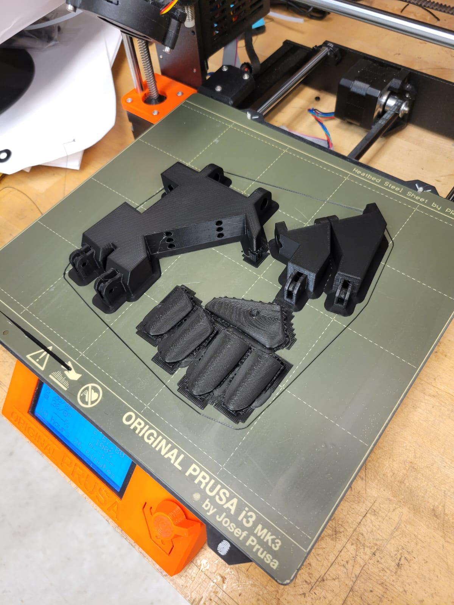

## Expressive Robotic Hand with Computer Vision and Servo Control

## Overview

The Expressive Robotic Hand project combines servo motor control with computer vision (CV) to create a robotic hand that recognizes hand gestures and adjusts its own movement accordingly. The project uses MediaPipe for gesture detection and Arduino to control the servo motors. The robotic hand can either be controlled manually via serial communication or automatically by mapping recognized gestures to servo positions.


Key Features

    Servo Motor Control: The robotic hand uses 5 servo motors to mimic human finger movements.
    Computer Vision: Gesture recognition using MediaPipe and OpenCV is implemented to detect the user’s hand movements and control the servos.
    Serial Communication: Data is sent from the CV system to the Arduino, which processes the values and adjusts the servo positions.
    Dynamic Calibration: A calibration step ensures that the system adapts to different hand sizes and positions.

Project Components
Hardware

    5 Servo Motors
    Arduino Uno/ESP32
    Jumper wires and breadboard
    External power supply for motors
    Webcam for hand gesture detection
    PC for running the computer vision code

Software

    Arduino Code: Controls the servo motors based on input received via serial communication.
    Python CV Code: Uses MediaPipe and OpenCV for hand gesture recognition and sends calculated servo angles to the Arduino.

Code Structure

    Python Code for Gesture Recognition and Serial Communication (gesture_control.py):
        Detects hand gestures using MediaPipe.
        Maps distances between fingertips and the palm to servo angles.
        Sends the calculated angles to the Arduino via serial communication.

    Arduino Code for Servo Control (main.ino):
        Receives servo angle data from the Python script via serial.
        Controls the servos based on the received angle data.

Here’s an updated README with details on how to implement both the Computer Vision (CV) and Arduino Servo Control codes and how they interact to create the final project.
Expressive Robotic Hand with Computer Vision and Servo Control
Overview

The Expressive Robotic Hand project combines servo motor control with computer vision (CV) to create a robotic hand that recognizes hand gestures and adjusts its own movement accordingly. The project uses MediaPipe for gesture detection and Arduino to control the servo motors. The robotic hand can either be controlled manually via serial communication or automatically by mapping recognized gestures to servo positions.
Key Features

    Servo Motor Control: The robotic hand uses 5 servo motors to mimic human finger movements.
    Computer Vision: Gesture recognition using MediaPipe and OpenCV is implemented to detect the user’s hand movements and control the servos.
    Serial Communication: Data is sent from the CV system to the Arduino, which processes the values and adjusts the servo positions.
    Dynamic Calibration: A calibration step ensures that the system adapts to different hand sizes and positions.

Project Components
Hardware

    5 Servo Motors
    Arduino Uno/ESP32
    Jumper wires and breadboard
    External power supply for motors
    Webcam for hand gesture detection
    PC for running the computer vision code

Software

    Arduino Code: Controls the servo motors based on input received via serial communication.
    Python CV Code: Uses MediaPipe and OpenCV for hand gesture recognition and sends calculated servo angles to the Arduino.

Code Structure

- Python Code for Gesture Recognition and Serial Communication (gesture_control.py):
        Detects hand gestures using MediaPipe.
        Maps distances between fingertips and the palm to servo angles.
        Sends the calculated angles to the Arduino via serial communication.

- Arduino Code for Servo Control (main.ino):
        Receives servo angle data from the Python script via serial.
        Controls the servos based on the received angle data.

Implementation Steps

1. Clone the repository
    ```
    git clone https://github.com/yourusername/expressive-robotic-hand.git

    cd expressive-robotic-hand
    ```
2. . Install Python Dependencies for Computer Vision

    ```
    pip install opencv-python mediapipe numpy pyserial
    ```
3. Connect the hardware
    Connect your servo motors to the specified control pins on the Arduino.
Ensure the external power supply is providing enough power to the servos.
Connect the Arduino to your PC via USB.
Ensure your camera is connected for hand gesture recognition.

4. . Upload the Arduino Code

    Open the Arduino IDE.
    Open the arduino_code.ino file located in the Arduino/ folder.
    Select your board and port from Tools > Board and Port.
    Click Upload to upload the code to your Arduino.

5. Run the Python Gesture Recognition Code

    Open a terminal or command prompt.
    Navigate to the folder containing the Python code (gesture_control.py).

    Run the Python script:

    ```
    python gesture_control.py

    ```
6. Calibrate the Hand Gesture System

    Upon running the Python script, the system will start with a 10-second calibration phase. During this time, move your hand naturally to allow the system to detect the minimum and maximum distances between your fingertips and the palm.

    After calibration, the system will automatically start tracking your hand and sending the mapped servo angles to the Arduino.

# Design of Robotic Hand:

For the Expressive Robotic Hand, our design was created using SolidWorks and then 3D printed to bring the model to life. We used this approach to ensure the precision and durability required for the hand’s complex movements. However, you're welcome to explore alternative design methods or tools that suit your needs. Below is a snapshot of our 3D model.



